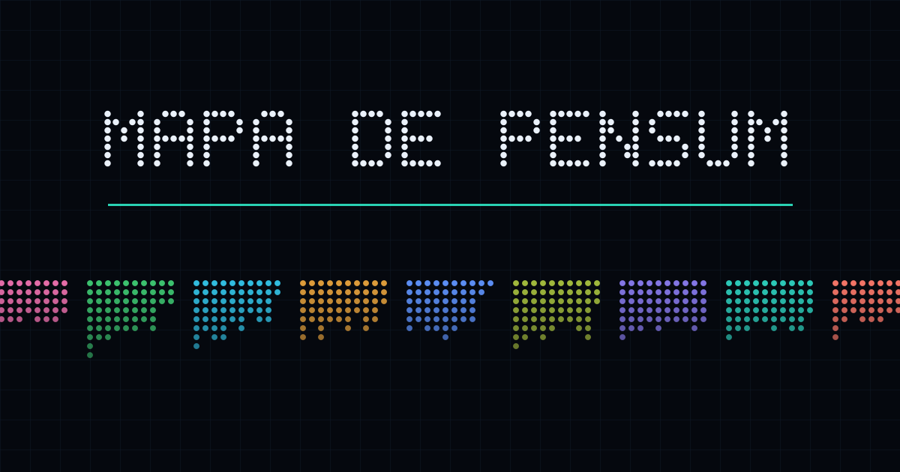
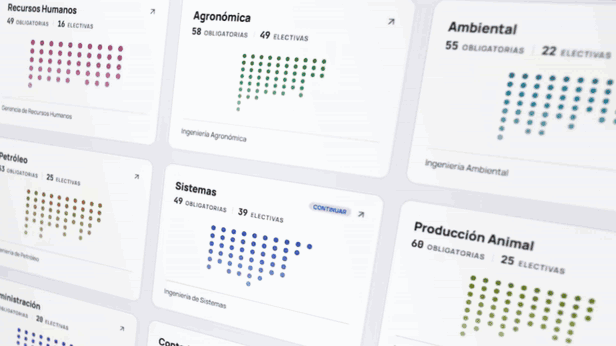
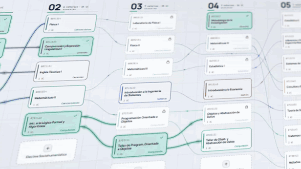
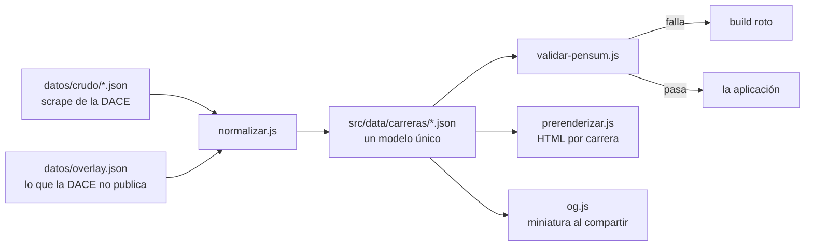
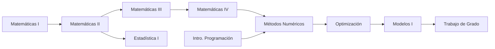
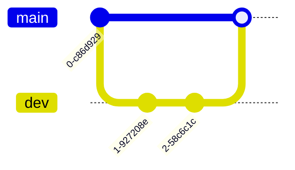
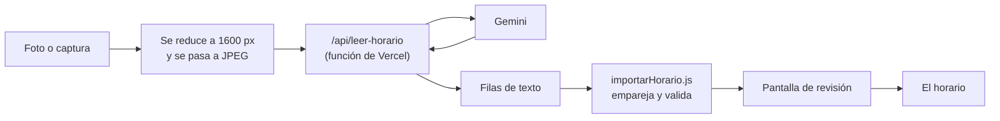

<div align="center">



# Mapa de Pensum

**Tu carrera como un mapa: qué materia desbloquea cuál, qué puedes inscribir ahora y cuánto te falta.**

Las nueve carreras de la Universidad de Oriente, Núcleo de Monagas, dibujadas como el grafo de prelaciones que en realidad son.

[**Abrir la aplicación →**](https://mapa-pensum.vercel.app)

`Vite` · `React` · `JavaScript` · `Tailwind CSS` · `SVG a mano` · `Sin backend`

</div>

---

## El problema

La DACE publica cada pensum como una tabla. Una tabla te dice que Fitopatología Aplicada requiere Microbiología Vegetal, pero no te dice que si la dejas para después arrastras cuatro materias contigo, ni cuáles puedes inscribir el semestre que viene, ni cuánto te falta de verdad.

Un pensum **no es una lista: es un grafo dirigido**. Esta herramienta lo dibuja como tal.

## Qué hace

| | |
|---|---|
| **Mapa de prelaciones** | Cada materia es un nodo, cada prelación un cable. Los cables no cruzan ninguna tarjeta: el ruteo lo garantiza |
| **Marcar tu avance** | Aprobada, cursando o sin cursar. Se guarda en tu navegador, sin cuentas ni servidores |
| **Qué puedes inscribir** | Al marcar, las materias con las prelaciones cumplidas se desbloquean solas |
| **Cadena al señalar** | Pasa el cursor sobre una materia y se ilumina todo lo que necesita y todo lo que habilita |
| **Planificador** | Dice en cuántos semestres terminas según la carga que puedas llevar, y lo exporta a PDF o Markdown |
| **Vista de lista** | En el teléfono el mapa completo se vería a escala 0,10. La lista es la vista principal en móvil |
| **Nueve carreras** | Cada una con su color, su ruta y su propia vista previa al compartir |

## Las nueve carreras

| Carrera | Obligatorias | Electivas | UC oblig. | Cadena más larga | Créditos del título |
|---|---:|---:|---:|---:|---:|
| [Gerencia de Recursos Humanos](https://mapa-pensum.vercel.app/gerencia-de-recursos-humanos) | 49 | 16 | 149 | 6 | — |
| [Ingeniería Agronómica](https://mapa-pensum.vercel.app/ingenieria-agronomica) | 58 | 49 | 150 | 6 | — |
| [Ingeniería Ambiental](https://mapa-pensum.vercel.app/ingenieria-ambiental) | 55 | 22 | 153 | 5 | — |
| [Ingeniería de Petróleo](https://mapa-pensum.vercel.app/ingenieria-de-petroleo) | 53 | 25 | 150 | **9** | — |
| [Ingeniería de Sistemas](https://mapa-pensum.vercel.app/ingenieria-de-sistemas) | 49 | 39 | 132 | **9** | **153** |
| [Ingeniería en Producción Animal](https://mapa-pensum.vercel.app/ingenieria-en-produccion-animal) | 60 | 25 | 160 | 6 | — |
| [Licenciatura en Administración](https://mapa-pensum.vercel.app/licenciatura-en-administracion) | 56 | 20 | 155 | 7 | — |
| [Licenciatura en Contaduría Pública](https://mapa-pensum.vercel.app/licenciatura-en-contaduria-publica) | 56 | 23 | 155 | 8 | — |
| [Licenciatura en Tecnología de los Alimentos](https://mapa-pensum.vercel.app/licenciatura-en-tecnologia-de-los-alimentos) | 45 | 36 | 140 | 4 | — |

**736 materias** en total. La *cadena más larga* es el número mínimo de semestres que impone la estructura de prelaciones: en Petróleo hay nueve materias encadenadas una detrás de otra, así que **no hay carga académica que permita terminar en menos de nueve semestres**. Es el tipo de cosa que la tabla original no te dice.

Solo Sistemas tiene los créditos del título confirmados. Ver [Honestidad con los datos](#honestidad-con-los-datos).

## En movimiento

<div align="center">

### Las nueve carreras



**Cada carrera con su color y la silueta de su pensum.**
Los puntos no son decoración: son sus materias, una por una, agrupadas por semestre.
De un vistazo se ve cuál es más larga, cuál carga más al principio y cuál se abre al final.

<br>

### El mapa



**Señala una materia y se ilumina toda su cadena**: lo que necesita y lo que habilita.
Púlsala y se abre su ficha, con sus prelaciones y el estado en el que va.
Al marcarla como aprobada, la corriente recorre los cables y enciende lo que acabas de desbloquear.

</div>

## Cómo funciona

### El flujo de datos



El crudo **no se edita nunca**. Cuando la DACE actualice un pensum se vuelve a bajar y el overlay sobrevive. **Agregar una carrera es dejar caer su JSON**: el normalizador la recoge, Vite le hace su propio chunk y aparece en el selector con su silueta. Ponerle color y créditos en el overlay es opcional.

### El grafo

Cada materia es un nodo y cada prelación una arista dirigida. La posición es determinista: **X según el semestre, Y según el índice dentro del semestre.** Nada de simulaciones de fuerzas.



Un fragmento real de Sistemas. Fíjate en que **Métodos Numéricos necesita dos cosas a la vez**: el grafo no es un árbol, y por eso una materia puede tener varios cables entrando.

## Decisiones técnicas

Las que explican casi todo el código.

<details>
<summary><b>El SVG está dibujado a mano, sin librería de grafos</b></summary>

<br>

`react-flow` son unos 50 kB comprimidos de un editor de nodos que aquí no hace falta, y habría que pelearle la restricción de que *la columna es el semestre*. `elkjs` pesa alrededor de 1 MB porque es Java compilado a JavaScript. `dagre` son unos 30 kB para calcular capas cuando la capa ya te la da el dato.

El público de esto está en Venezuela: hay muchos teléfonos viejos y los datos móviles se pagan. Cada kilobyte cuenta, así que el grafo se dibuja a mano y el enrutador también (cuarenta líneas contra los ~10 kB de react-router para dos rutas sin parámetros anidados).

</details>

<details>
<summary><b>Ningún cable pasa por encima de una tarjeta</b></summary>

<br>

Las prelaciones entre semestres contiguos van por el pasillo vacío que queda entre columnas. Los saltos largos —de 3.º a 7.º, por ejemplo— se rutean por el **corredor horizontal libre entre dos tarjetas** de las columnas intermedias.

Es la parte más delicada del proyecto y se verifica muestreando cientos de puntos de cada trazado contra todos los rectángulos de las tarjetas. El invariante es cero colisiones.

</details>

<details>
<summary><b>Los filtros SVG están prohibidos en los cables</b></summary>

<br>

`feGaussianBlur` con las unidades por defecto (`objectBoundingBox`) calcula la región del filtro a partir de la caja del elemento. En una línea perfectamente horizontal esa caja **tiene altura cero**, así que la región del filtro es nula y el elemento no se pinta.

Se descubrió porque cinco cables rectos eran invisibles. El brillo se hace apilando trazos cada vez más anchos y transparentes; no hay ni un filtro en el mapa.

</details>

<details>
<summary><b>Las animaciones nunca se desmontan</b></summary>

<br>

Al salir de un *hover*, las luces que recorren los cables se quedaban congeladas dos o tres segundos. La causa: los trazados animados se desmontaban al atenuarse, y al volver a montarlos la animación reiniciaba **y volvía a esperar su retardo**.

Ahora solo cambia la opacidad, y los retardos son negativos para que cada animación nazca ya empezada en un punto distinto del ciclo. Sincronizadas todas se verían como un metrónomo.

</details>

<details>
<summary><b>La View Transition era bonita y se quitó</b></summary>

<br>

La idea era que la tarjeta del selector se desplegara hasta convertirse en el mapa, con la [View Transitions API](https://developer.mozilla.org/en-US/docs/Web/API/View_Transition_API) haciendo la interpolación. El efecto funciona. El precio no: para interpolar, el navegador **rasteriza en una textura el antes y el después de la página**, y el después es un SVG de mil seiscientos elementos a pantalla completa. Mientras lo hace, la página está congelada de verdad — no responde a nada.

Eran tres o cuatro segundos. La pista de que la culpa no era de React fue que **volver al selector tardaba lo mismo**, y ahí React no tiene nada que hacer: se mide en cero milisegundos. Lo que corría en los dos sentidos era la transición, y al volver lo que hay que fotografiar sigue siendo el mapa.

En su lugar el cambio va en dos tiempos y lo hace CSS: la vista actual se despide (170 ms) y la nueva entra (420 ms). Solo se tocan opacidad y una escala del uno por ciento — las dos propiedades que el compositor resuelve sin repintar nada. Entremedias, el mapa se monta un fotograma después de que aparece la cabecera, y ese hueco lo ocupa la silueta de la carrera, que vive en el índice y por tanto ya está en memoria en el instante del click.

Esa silueta hace además el trabajo que hacía la transición: el mapa aparece justo encima de la forma que ya estaba ahí.

Medido fotograma a fotograma sobre el build de producción, entrando a Sistemas:

| | Antes | Ahora |
|---|---|---|
| Click → el selector empieza a irse | — | **10 ms** |
| Click → mapa en pantalla | ~3-4 s congelados | 254 ms |
| Transición completa | ~3-4 s congelados | ~540 ms |
| Volver al selector | ~3-4 s congelados | ~600 ms, **cero tareas largas** |

La diferencia de fondo no está en los números sino en qué son: antes eran segundos de página muerta, ahora son medio segundo de animación que se puede interrumpir.

> [!NOTE]
> El primer intento fue quitar la animación del todo. Quedó en 5 ms y se sentía brusco: sin un tiempo de salida, el cambio se lee como un corte de vídeo. Los 170 ms de despedida no son latencia, son la parte que faltaba.

</details>

<details>
<summary><b>El color sale del dato, no de una decisión por componente</b></summary>

<br>

Sistemas tiene sus ocho áreas clasificadas a mano y de ahí sale su color. Las otras siete no las tienen, y pintarlas de un solo color deja el mapa plano.

Ahí el tono se reparte entre diez colores en arco alrededor del color de la carrera, y **cuál le toca a cada materia sale de un hash de su código**. Parece azar, pero la misma materia sale siempre del mismo color: un azar de verdad cambiaría el mapa en cada recarga y dejarías de reconocer el tuyo.

</details>

<details>
<summary><b>Se prerenderiza el contenido, no la aplicación</b></summary>

<br>

Para que un buscador encuentre "pensum administración UDO Monagas" hace falta HTML con texto real. La ruta habitual sería renderizar React en el servidor, pero varios *hooks* leen `window` y `localStorage` al inicializar y habría que blindarlos todos para ganar algo que aquí no aporta: el estado es cien por cien del cliente.

Así que el build escribe un HTML por carrera con su `<title>`, canonical, Open Graph, JSON-LD y **la lista completa de materias en el markup**. React vacía ese contenido y monta la aplicación encima.

</details>

<details>
<summary><b>El service worker se genera, no se escribe</b></summary>

<br>

Los archivos del build llevan hash en el nombre. Una lista de precarga escrita a mano se quedaría vieja en el primer despliegue y el service worker seguiría sirviendo la versión anterior **para siempre**, que es la forma clásica de romper esto. Así que `scripts/serviceworker.js` lee `dist/` cuando ya está construido y emite la lista real, con una versión sacada del hash de todo el contenido.

Se prefirió a `vite-plugin-pwa` por lo de siempre en este proyecto: son setenta líneas legibles frente a una dependencia con su propio runtime. Y sobre todo, **la política de caché aquí hay que entenderla, no heredarla**: servir un pensum viejo sin avisar sería exactamente lo que este proyecto promete no hacer. Por eso navegar va a la red primero.

Un detalle que solo se ve al probarlo: la precarga usa `cache.add` uno por uno y no `addAll`, porque `addAll` es atómico — si un solo recurso falla, tira toda la instalación y el usuario se queda sin nada guardado.

</details>

<details>
<summary><b>El favicon no era del proyecto</b></summary>

<br>

Era un rayo morado `#863bff` con dieciséis filtros de desenfoque y 9,5 kB, resto de una plantilla. Junto a él viajaba un `icons.svg` de 5 kB con iconos de Bluesky, Discord y X **que no se usaba en ninguna parte**.

Ahora la marca es la misma que preside el selector: `waypoints` de Lucide, tres nodos y sus enlaces, que es literalmente de lo que va la aplicación. La geometría está copiada del propio Lucide para que el icono de la pestaña y el logotipo de la cabecera sean el mismo dibujo y no dos parecidos, y los PNG de la app instalable se rasterizan en el build con el mismo lienzo que hace la miniatura de compartir.

El favicon pasó de 9.522 a 749 bytes.

</details>

<details>
<summary><b>La miniatura al compartir se dibuja en Node, sin dependencias</b></summary>

<br>

`scripts/og.js` compone la imagen píxel a píxel y codifica el PNG con `zlib`, que ya viene en la plataforma. La alternativa era traer `sharp` o `resvg` para rasterizar un SVG: decenas de megas de binario por una imagen que no cambia nunca.

El texto va en matriz de puntos con una fuente de 5×7 escrita en el propio script, con las ocho letras que hacen falta y ni una más. No es una carencia disimulada: el proyecto entero son puntos y cables. Las siluetas de abajo salen del índice real, así que **la imagen se actualiza sola al agregar una carrera**.

</details>

## Honestidad con los datos

Los pensums vienen de lo que publica la DACE y pueden tener errores o estar desactualizados. Tres reglas que se siguen sin excepción:

**1. Lo que no se sabe, no se muestra.** Solo Sistemas tiene los créditos del título confirmados (153, contra INTRADACE). En las otras siete **no aparece el porcentaje de avance**, porque no hay denominador honesto. El chip de la cabecera cuenta materias en vez de inventar un total. Si algún día llegan los créditos oficiales de una carrera, se llenan en su overlay y esa carrera sube de nivel sola.

**2. Las reglas se verifican antes de usarse.** Los códigos parecen codificar información. Una de las dos aguanta:

| Regla | Situación | Uso |
|---|---|---|
| Último dígito = unidades crédito | Convención de la UDO, no una inferencia nuestra | **Se deriva** |
| Penúltimo dígito = semestre | **Falla el 73 %** en Sistemas, 66 % en Petróleo, 71 % en Alimentos | **Descartada** |

El semestre sale de las claves del JSON y de ningún otro sitio. La segunda parecía cierta mirando un solo pensum; generalizarla habría corrompido la mitad de los datos en silencio.

El validador **no** comprueba la primera. La UC se deriva de ese dígito en el normalizador, así que compararlos sería preguntarle a un dato si es igual a sí mismo. Se documenta aquí para que nadie la eche de menos y la vuelva a añadir.

**3. Lo que huele raro se avisa, no se corrige a mano.** En Administración y Contaduría **ninguna materia del semestre 10 declara prelaciones**, ni siquiera el Trabajo de Grado, cuando en las otras seis carreras siempre cuelga del seminario previo. Es casi seguro un hueco de la fuente, pero inventar la prelación sería peor. El validador lo marca como aviso y en el mapa se ve tal cual: sin cables.

## El validador

`npm run validar` corre sobre los pensums normalizados —lo mismo que lee la aplicación— y sale con código 1 si algo no cuadra, así que **un scrape malo rompe el build en vez de llegar a producción**.

Por carrera comprueba códigos duplicados, prelaciones que apunten a materias inexistentes, prelaciones en semestre igual o posterior, ciclos en el grafo (DFS con marcado tricolor), coherencia de créditos y cuotas alcanzables con la oferta real.

```
ok      gerencia-de-recursos-humanos       49 oblig   16 en 2 grupos  149 UC  (sin creditos oficiales)
ok      ingenieria-agronomica              58 oblig   49 en 3 grupos  150 UC  (sin creditos oficiales)
ok      ingenieria-de-sistemas             49 oblig   39 en 2 grupos  132 UC  titulo 153
avisos  licenciatura-en-administracion     56 oblig   20 en 2 grupos  155 UC  (sin creditos oficiales)
        AVISO  Ninguna de las 5 materias del semestre 10 declara prerrequisitos.
```

Acepta una ruta alterna, útil para probarlo contra datos rotos a propósito:

```bash
node scripts/validar-pensum.js ruta/a/otra/carpeta
```

## Rutas y SEO

```
/           Selector: las nueve carreras
/<slug>     Mapa de una carrera
```

Cada carrera es un chunk aparte (~2,5 kB comprimidos) que se baja al entrar, y que **se empieza a bajar al pasar el cursor por su tarjeta**, décimas de segundo antes del click. El click no lo espera: con el dedo no hay *hover*, y un botón que se queda pulsado sin que pase nada se lee como que la web se colgó. El build genera además `sitemap.xml` y `robots.txt`.

## Se guarda en el teléfono y abre sin internet

La aplicación se puede instalar. Una vez instalada **abre sin conexión y no vuelve a gastar datos** para consultar el pensum: el service worker guarda las nueve carreras completas, la tipografía y los iconos, unos 780 kB una sola vez.

Eso importa aquí más que en otros sitios. El público objetivo mira su pensum muchas veces, desde teléfonos modestos y con datos que paga por megabyte.

| | Estrategia | Por qué |
|---|---|---|
| Navegación (`/`, `/<slug>`) | Red primero, caché de respaldo | Con conexión siempre se ve el pensum publicado hoy. La copia es la red de emergencia, no la fuente. |
| Assets (`/assets/*`) | Caché primero | Llevan hash en el nombre: un nombre concreto no cambia nunca de contenido. |
| Telemetría (`/_vercel/*`) | Nunca se toca | O llega a la red o no llega. |

El aviso de instalar sale abajo, a los dos segundos y medio, y se cierra para siempre. En iPhone no existe `beforeinstallprompt`, así que ahí se explica el gesto de *Compartir → Añadir a inicio*.

> [!NOTE]
> **La analítica sigue funcionando.** Instalada, la app manda sus datos a Vercel igual que en el navegador. Lo único que no se cuenta son las visitas hechas **sin conexión**, porque no hay red por la que enviarlas — eso es inherente a estar sin internet, no a la instalación.

## Estructura

```
api/
└── leer-horario.js         Lee un horario de una imagen. La clave vive aquí, no en el front.
datos/
├── crudo/                  Scrape de la DACE tal cual. No se edita.
└── overlay.json            Color, créditos y avisos por carrera
scripts/
├── normalizar.js           crudo + overlay → modelo único
├── validar-pensum.js       Puerta de calidad del build
├── prerenderizar.js        Un HTML por carrera, con contenido rastreable
├── png.js                  Lienzo de píxeles y codificador PNG, sin dependencias
├── og.js                   La miniatura al compartir, píxel a píxel
├── iconos.js               Los iconos de la app instalable
└── serviceworker.js        Genera dist/sw.js con la lista de precarga
src/
├── data/carreras.js        Índice, caché y carga por carrera
├── data/leerHorario.js     Reduce la imagen y pregunta a /api
├── layout/
│   ├── constantes.js       Toda la geometría del mapa
│   ├── calcularLayout.js   Asignaturas → coordenadas (función pura)
│   ├── aristas.js          Ruteo de los cables
│   ├── relaciones.js       Adyacencia y cadenas de prelaciones
│   ├── planificador.js     Reparto de materias por semestre
│   ├── horario.js          Medidas de la semana y reglas de convivencia
│   ├── importarHorario.js  Lo leído → clases de este pensum, con sus avisos
│   └── pico.js             La forma del piquito de las nubecitas
├── hooks/
│   ├── usePensum.js        Estados, progreso y persistencia
│   ├── useVistaGrafo.js    Pan, zoom y encaje
│   ├── useRuta.js          Enrutador, sin librería
│   └── useTema.js          Claro/oscuro
├── components/             Selector, grafo, nodos, aristas, paneles, plan
└── theme/                  Áreas, paleta por carrera y fondos procedurales
```

## Desarrollo

```bash
npm install
npm run dev
```

| Script | Qué hace |
|---|---|
| `npm run dev` | Normaliza los datos y arranca el servidor de desarrollo |
| `npm run datos` | Genera `src/data/carreras/` desde `datos/` |
| `npm run validar` | Valida los pensums normalizados |
| `npm run build` | Normaliza, valida, compila, genera la miniatura y prerenderiza |
| `npm run preview` | Sirve el build ya compilado |
| `npm run lint` | oxlint |
| `npm test` | Las pruebas de los módulos puros de `src/layout/` |

`src/data/carreras/` está generado y no se versiona: sale minificado y su diff sería una sola línea gigante.

## Despliegue

Desplegado en **Vercel**. El repo trae `vercel.json`: al importar el repositorio, Vercel detecta Vite, corre `npm run build` y publica `dist/`.

El flujo de trabajo usa dos ramas:



- `git push origin dev` → Vercel crea un **despliegue de vista previa** con su propia URL, para probar sin tocar producción
- `git push origin main` → publica en `mapa-pensum.vercel.app`

**Analítica.** `@vercel/analytics` cuenta las visitas y `@vercel/speed-insights` mide el rendimiento real de quien usa la web —no el de un banco de pruebas—, que en este público es la métrica que importa. Los dos se montan en `src/main.jsx` y hay que activarlos una vez desde el panel del proyecto.

> [!NOTE]
> La documentación de Vercel sugiere importar desde `@vercel/speed-insights/next`. Eso es para Next.js. Aquí es Vite, y la subruta correcta es **`/react`**.

## Leer un horario de una foto

El horario vacío ofrece dos salidas: **subir una foto** del que dio INTRADACE, o **crearlo a mano**. La primera manda la imagen a Gemini, que devuelve las clases en JSON.



**La clave no puede vivir en el front.** Vite sustituye las variables `VITE_*` dentro del bundle en tiempo de compilación, así que una clave con ese prefijo queda publicada: cualquiera abre las herramientas del navegador, la copia y quema la cuota. Por eso existe `api/leer-horario.js`, que corre en el servidor y es el único que ve la clave.

Para que funcione hay que poner **`GOOGLE_AI_API_KEY`** en Vercel (*Project → Settings → Environment Variables*), sacada de [aistudio.google.com/apikey](https://aistudio.google.com/apikey). `GOOGLE_AI_MODELO` es opcional y sirve para cambiar de modelo sin desplegar código, que hace falta más a menudo de lo que parece: Google jubila y renombra modelos. Los dos están en `.env.example`.

**El reparto de responsabilidades importa.** La función no decide nada: recibe una imagen, la manda y devuelve filas de texto. Emparejar con el pensum, validar las horas y detectar choques ocurre en el navegador, en `src/layout/importarHorario.js`, que es función pura y tiene sus pruebas. Así las reglas de esta aplicación se comprueban sin red y sin cuota.

**Nada entra sin revisión.** Lo que vuelve es lo que un modelo *creyó ver* en una foto que puede estar torcida o con reflejos, y una materia mal leída no se nota al importarla: se nota el día del parcial. La pantalla de revisión enseña la foto al lado de las filas, marca lo que no cuadra —materia que no está en el pensum, día que no se entendió, clases que se pisan— y deja corregir materia, día y horas antes de confirmar.

> [!NOTE]
> `npm run dev` no levanta las funciones: Vite devuelve el `index.html` para cualquier ruta. Para probar la lectura en local hace falta `vercel dev`. La aplicación lo detecta y lo dice en vez de fallar con un error que despista.

> [!WARNING]
> La comprobación de origen de la función es un badén, no una cerradura: una cabecera se falsifica en una línea de `curl`. Frena el uso casual desde otra página, pero un límite por IP de verdad necesitaría un almacén que este proyecto no tiene. Si la cuota empieza a gastarse sola, ahí está la causa.

## Accesibilidad

Navegación por teclado en los controles, `<title>` descriptivo en cada nodo del SVG, contraste AA verificado en ambos temas y `prefers-reduced-motion` respetado en todas las animaciones, incluidas las transiciones de página y el efecto 3D del selector.

## ¿Ves un dato mal?

Repórtalo. El pie de la página abre un [issue con el formulario ya redactado](../../issues/new): carrera, materia, qué dice el pensum oficial y de dónde lo sacas. Con esos cuatro datos se corrige; sin ellos no.

Es la contrapartida de la sección anterior. Si el proyecto promete no inventar lo que no sabe, tiene que dar la vía para corregir lo que sí dice.

## Créditos y aviso

Datos tomados de los pensums publicados por la [DACE del Núcleo de Monagas](http://dacemonagas.udo.edu.ve).

> [!IMPORTANT]
> Esta herramienta es un apoyo para visualizar tu carrera, **no una fuente oficial**. Confirma siempre con control de estudios antes de tomar cualquier decisión académica.

Iconos de [Lucide](https://lucide.dev). Tipografías Manrope y JetBrains Mono servidas desde el propio bundle con `@fontsource`, sin llamadas a terceros.
